# Приоритизация и многопоточность в LLM Proxy

Документация описывает архитектуру и алгоритмы работы приоритизации запросов и управления конкурентностью в системе.

## Содержание

1. [Обзор архитектуры](#обзор-архитектуры)
2. [Уровни приоритета](#уровни-приоритета)
3. [Поток обработки запроса](#поток-обработки-запроса)
4. [Приоритетная очередь](#приоритетная-очередь)
5. [Контроллер конкурентности](#контроллер-конкурентности)
6. [Механизм прерывания (Preemption)](#механизм-прерывания-preemption)
7. [Retry механизм](#retry-механизм)
8. [Многопоточность и корутины](#многопоточность-и-корутины)

---

## Обзор архитектуры

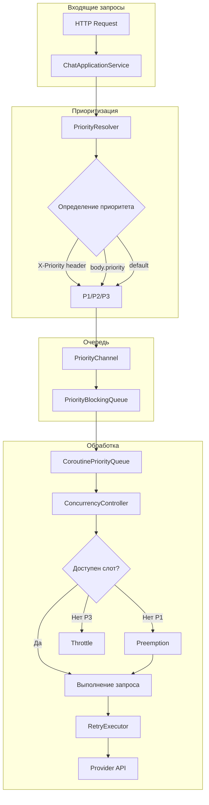

---

## Уровни приоритета

Система поддерживает три уровня приоритета:

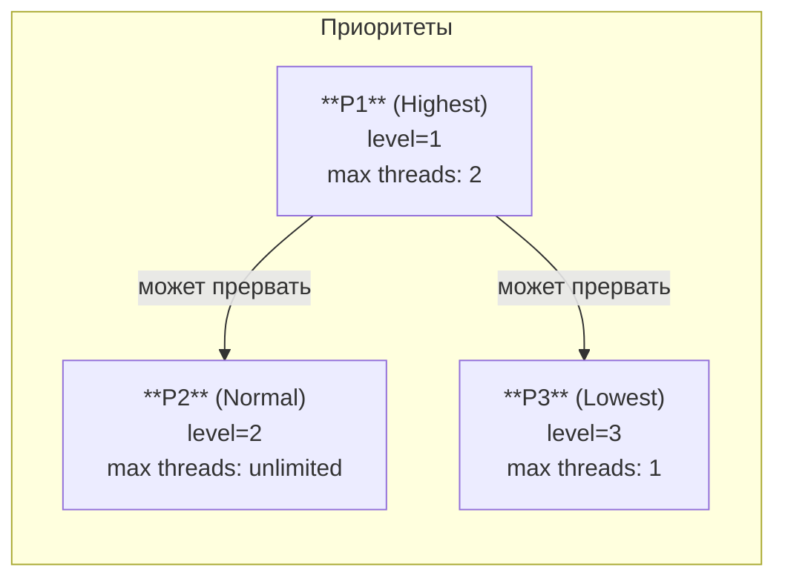

### Конфигурация приоритетов

| Приоритет | Level | Max Threads | Может прерывать | Throttle |
|-----------|-------|-------------|-----------------|----------|
| P1 | 1 | 2 | P2, P3 | Нет |
| P2 | 2 | все доступные | - | Нет |
| P3 | 3 | 1 | - | Да |

### Разрешение приоритета

```kotlin
// Источники приоритета (в порядке убывания приоритета):
// 1. Header X-Priority: "p1" | "p2" | "p3" | "highest" | "lowest"
// 2. Body field: { "priority": "p1" }
// 3. Default: P2

fun resolve(headerPriority: String?, bodyPriority: String?): Priority {
    return Priority.resolve(headerPriority)
        ?: Priority.resolve(bodyPriority)
        ?: config.defaultPriority
}
```

---

## Поток обработки запроса

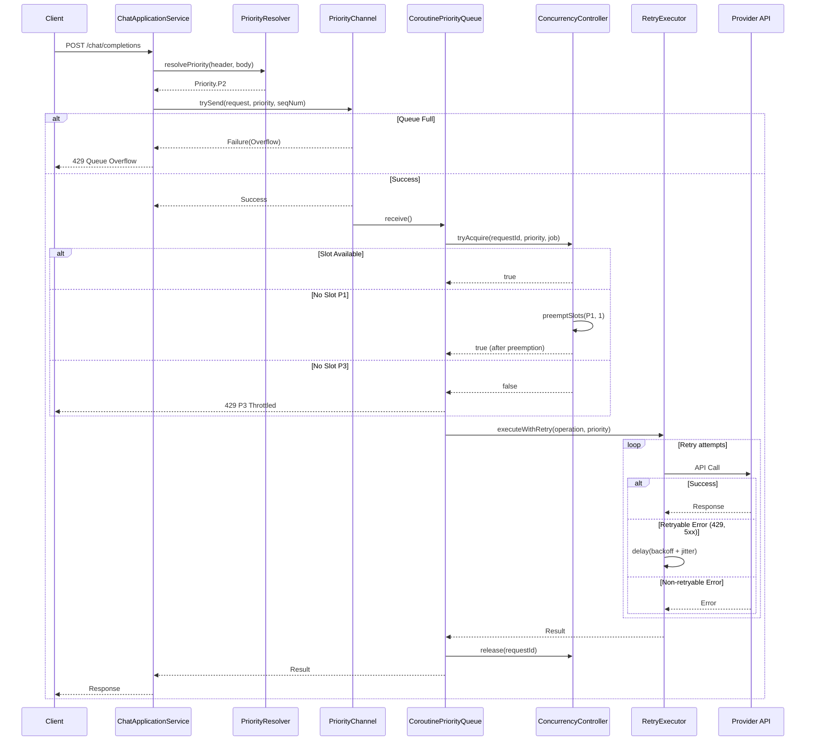

---

## Приоритетная очередь

### Архитектура PriorityChannel

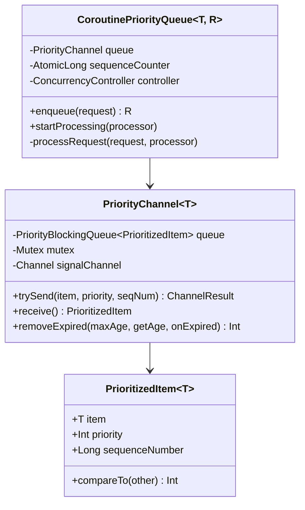

### Алгоритм упорядочивания

Элементы сортируются по двум критериям:

1. **Priority level** (по возрастанию) - меньшее значение = выше приоритет
2. **Sequence number** (по возрастанию) - FIFO внутри одного приоритета

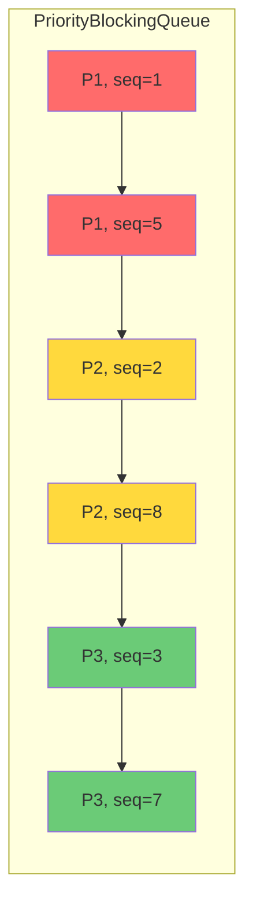

### Удаление просроченных запросов

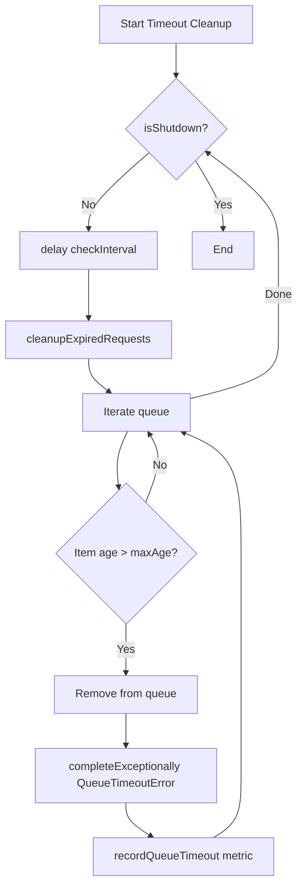

---

## Контроллер конкурентности

### Архитектура ConcurrencyController

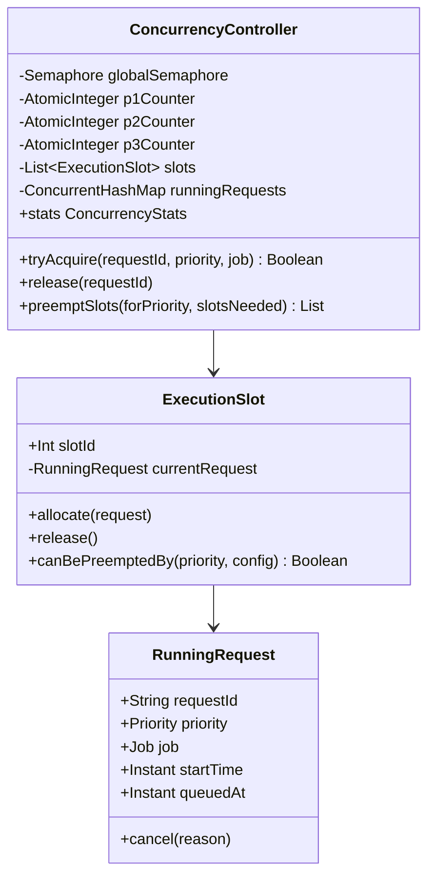

### Логика выделения слота

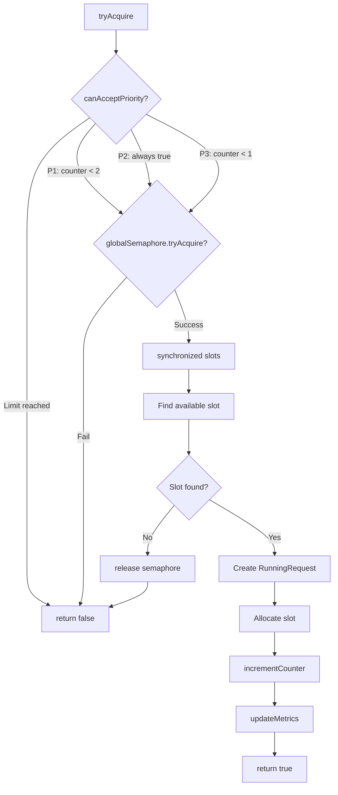

### Состояние слотов

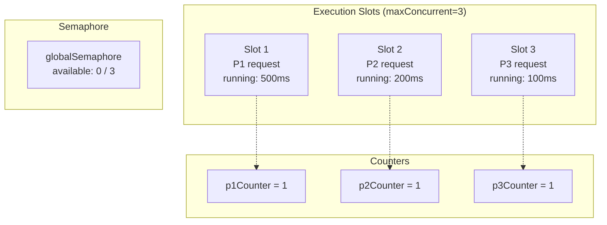

---

## Механизм прерывания (Preemption)

### Условия для прерывания

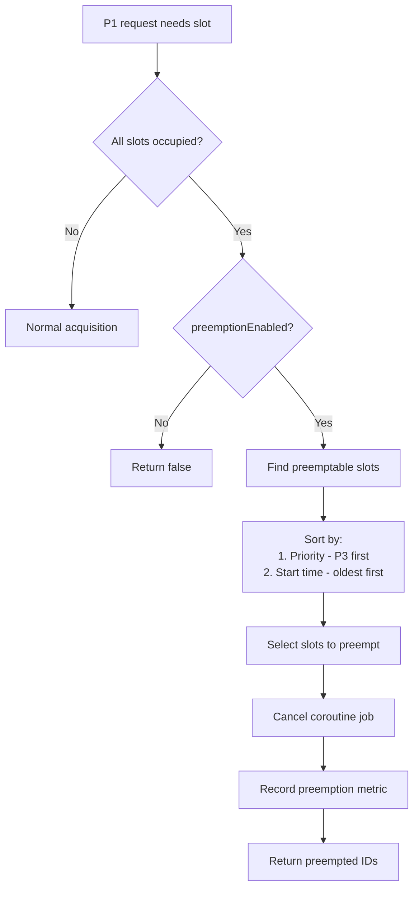

### Приоритеты для прерывания

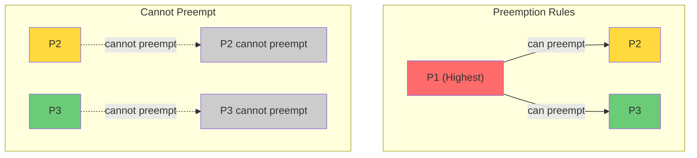

### Алгоритм выбора жертвы для прерывания

```kotlin
fun preemptSlots(forPriority: Priority, slotsNeeded: Int): List<String> {
    val preemptable = slots
        .filter { it.canBePreemptedBy(forPriority, config) }
        .sortedWith(compareBy(
            // Higher level (P3) first - меньший приоритет прерывается первым
            { -(it.currentRequest?.priority?.level ?: Int.MIN_VALUE) },
            // Older requests first
            { it.currentRequest?.startTime ?: Instant.MAX }
        ))
        .take(slotsNeeded)

    for (slot in preemptable) {
        request.job.cancel(CancellationException("Preempted by ${forPriority.value}"))
        metricsPort.recordPreemption(request.priority, forPriority)
    }

    return preemptedIds
}
```

### Пример прерывания

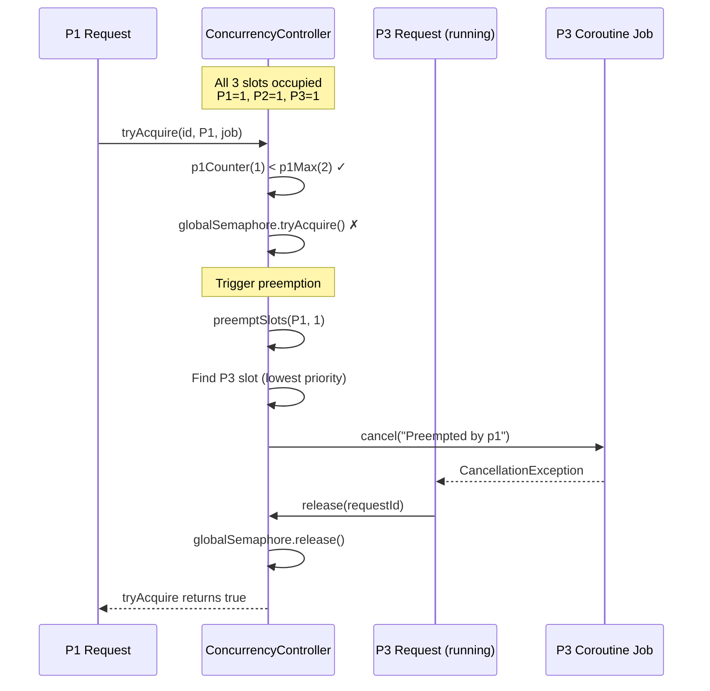

---

## Retry механизм

### Конфигурация Retry

```kotlin
data class RetryConfig(
    val enabled: Boolean = true,
    val maxAttempts: Int = 3,
    val initialDelayMs: Long = 1000,
    val maxDelayMs: Long = 10000,
    val backoffMultiplier: Double = 2.0,
    val retryableStatusCodes: Set<Int> = setOf(429, 500, 502, 503, 504)
)
```

### Алгоритм Retry с Exponential Backoff

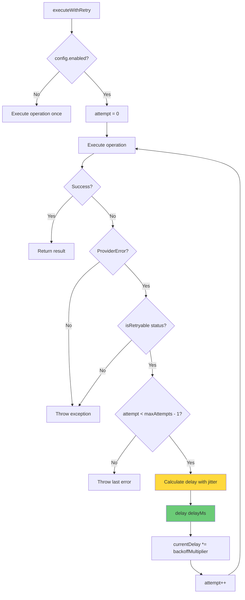

### Формула задержки с Jitter

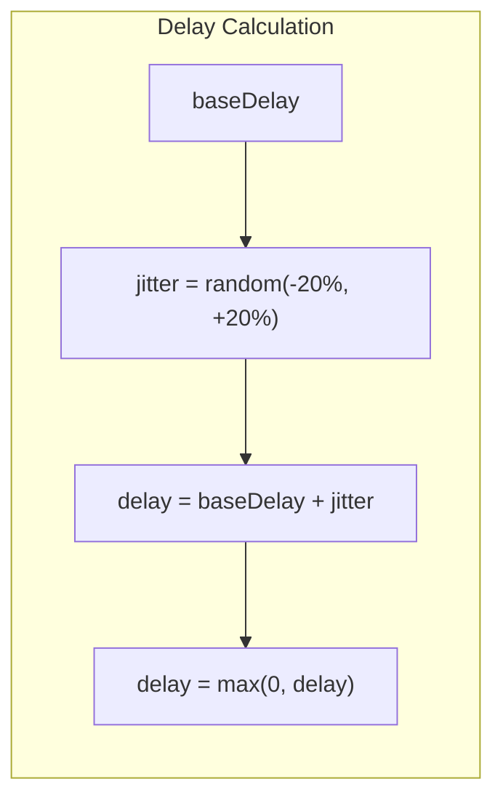

```kotlin
private fun calculateDelay(baseDelay: Long): Long {
    // Add jitter: +/- 20% of base delay
    val jitterRange = (baseDelay * 0.2).toLong()
    val jitter = Random.nextLong(-jitterRange, jitterRange + 1)
    return (baseDelay + jitter).coerceAtLeast(0)
}
```

### Пример retry последовательности

```mermaid
gantt
    title Retry Sequence (maxAttempts=3, initialDelay=1000ms, multiplier=2.0)
    dateFormat X
    axisFormat %s ms

    section Request
    Attempt 1           :a1, 0, 1s
    Wait (1000±200ms)   :w1, after a1, 1s
    Attempt 2           :a2, after w1, 1s
    Wait (2000±400ms)   :w2, after a2, 2s
    Attempt 3           :a3, after w2, 1s
```

---

## Многопоточность и корутины

### Архитектура корутин

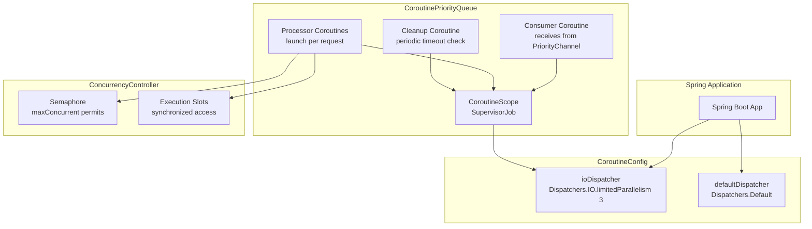

### Dispatcher конфигурация

```kotlin
@Configuration
class CoroutineConfig {
    // IO dispatcher для блокирующих операций (API calls)
    @Bean
    fun ioDispatcher(): CoroutineDispatcher =
        Dispatchers.IO.limitedParallelism(3)

    // Default dispatcher для CPU-bound операций
    @Bean
    fun defaultDispatcher(): CoroutineDispatcher =
        Dispatchers.Default
}
```

### Обработка запроса в корутине

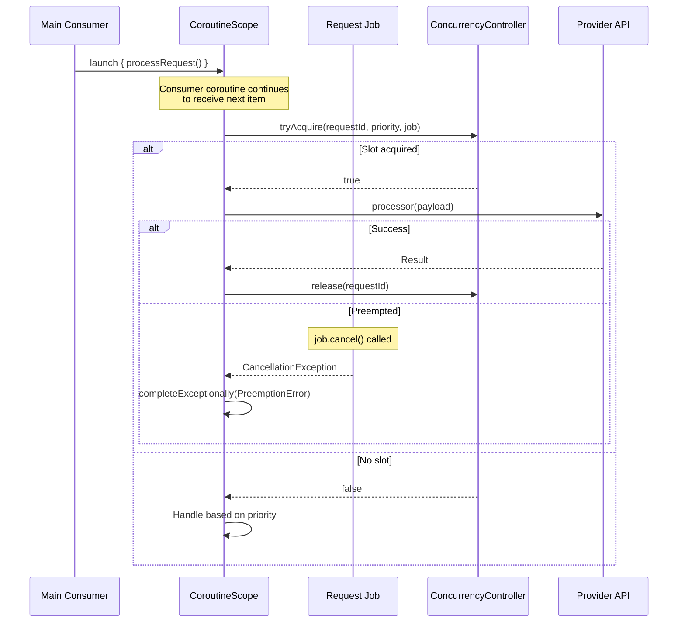

### Потокобезопасность

| Компонент | Механизм синхронизации | Обоснование |
|-----------|------------------------|-------------|
| PriorityChannel | Mutex (kotlinx.coroutines.sync) | Корутино-безопасная блокировка |
| ConcurrencyController.slots | synchronized(slots) | Атомарное выделение слота |
| ConcurrencyController.runningRequests | ConcurrentHashMap | Потокобезопасный доступ |
| Per-priority counters | AtomicInteger | Атомарные счётчики |
| Global semaphore | Semaphore (java.util.concurrent) | Глобальный лимит конкурентности |

### Структура корутин

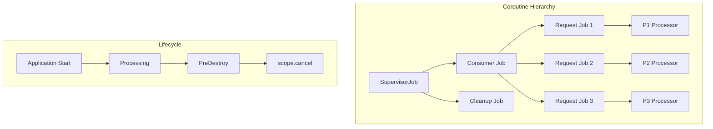

---

## Ключевые файлы

| Файл | Назначение |
|------|------------|
| `domain/model/Priority.kt` | Enum с уровнями приоритета |
| `domain/model/ConcurrencyConfig.kt` | Конфигурация лимитов |
| `infrastructure/queue/PriorityChannel.kt` | Приоритетный канал для корутин |
| `infrastructure/queue/CoroutinePriorityQueue.kt` | Основная реализация очереди |
| `infrastructure/queue/ConcurrencyController.kt` | Управление слотами и прерываниями |
| `infrastructure/queue/RetryExecutor.kt` | Retry с exponential backoff |
| `infrastructure/config/CoroutineConfig.kt` | Конфигурация диспетчеров |

---

## Конфигурация (application.yml)

```yaml
llm:
  proxy:
    queue:
      max-length: 100
      max-concurrent: 3
      p1-max-threads: 2
      p3-max-threads: 1
      preemption-enabled: true
      timeout-minutes: 5
      timeout-check-interval-ms: 60000
    retry:
      enabled: true
      max-attempts: 3
      initial-delay-ms: 1000
      max-delay-ms: 10000
      backoff-multiplier: 2.0
      retryable-status-codes:
        - 429
        - 500
        - 502
        - 503
        - 504
```

---

## Тестирование

Проект содержит комплексный набор тестов для проверки корректности работы приоритизации и конкурентности.

### Структура тестов

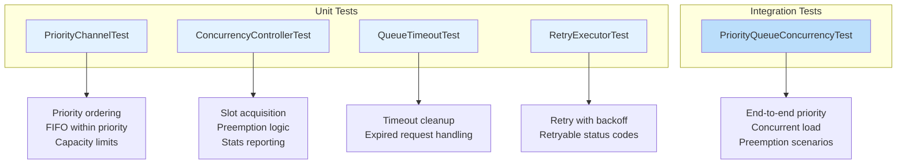

### Unit Tests

#### PriorityChannelTest

Файл: `src/test/kotlin/ru/ddd/llmproxy/unit/infrastructure/queue/PriorityChannelTest.kt`

**Проверяет:**
- Уорядочивание по приоритету (lower value = higher priority)
- FIFO порядок внутри одного приоритета
- Ограничение capacity
- Обработка overflow
- Корректность состояния empty/full

```kotlin
@Test
fun `should receive items in priority order`() = runTest {
    channel.trySend("low", priority = 3, sequenceNumber = 1)
    channel.trySend("high", priority = 1, sequenceNumber = 2)
    channel.trySend("medium", priority = 2, sequenceNumber = 3)

    assertEquals("high", channel.receive().item)   // P1 first
    assertEquals("medium", channel.receive().item) // P2 second
    assertEquals("low", channel.receive().item)   // P3 last
}
```

#### ConcurrencyControllerTest

Файл: `src/test/kotlin/ru/ddd/llmproxy/unit/infrastructure/queue/ConcurrencyControllerTest.kt`

**Проверяет:**
- Выделение слотов с per-priority лимитами
- Освобождение слотов и обновление счётчиков
- Логика прерывания для P1 приоритета
- Отчётность статистики

```kotlin
@Test
fun `should reject P3 when max 1 reached`() = runTest {
    // Given - one P3 already running
    controller.tryAcquire("p3-1", Priority.P3, Job(), Instant.now())

    // When - try second P3
    val result = controller.tryAcquire("p3-2", Priority.P3, Job(), Instant.now())

    // Then - should be rejected (max 1 P3 concurrent)
    assertFalse(result)
}

@Test
fun `should preempt P3 before P2`() = runTest {
    controller.tryAcquire("p2-1", Priority.P2, Job(), Instant.now())
    controller.tryAcquire("p3-1", Priority.P3, Job(), Instant.now())

    // When P1 needs slot - P3 should be preempted first
    val preempted = controller.preemptSlots(Priority.P1, 1)

    assertEquals("p3-1", preempted.first())
}
```

#### QueueTimeoutTest

Файл: `src/test/kotlin/ru/ddd/llmproxy/unit/infrastructure/queue/QueueTimeoutTest.kt`

**Проверяет:**
- Удаление просроченных запросов из очереди
- Генерация QueueTimeoutError для timed out запросов
- Запись метрик timeout
- Отключение timeout (timeoutMinutes=0)

```kotlin
@Test
fun `should remove expired items from queue`() = runTest {
    val oldRequest = createRequest("old", Priority.P3, Instant.now().minusMillis(11 * 60 * 1000))
    val newRequest = createRequest("new", Priority.P3, Instant.now())

    channel.trySend(oldRequest, Priority.P3.level, 1)
    channel.trySend(newRequest, Priority.P3.level, 2)

    val removedCount = channel.removeExpired(
        maxAgeMs = 10 * 60 * 1000L,
        getAgeMs = { Instant.now().toEpochMilli() - it.metrics.queuedAt.toEpochMilli() },
        onExpired = { }
    )

    assertEquals(1, removedCount)
    assertEquals("new", channel.receive().item.payload)
}
```

#### RetryExecutorTest

Файл: `src/test/kotlin/ru/ddd/llmproxy/unit/infrastructure/queue/RetryExecutorTest.kt`

**Проверяет:**
- Retry логика с exponential backoff
- Обработка non-retryable ошибок
- Лимит max attempts
- Поведение при отключенном retry

```kotlin
@Test
fun `should retry and succeed on second attempt`() = runTest {
    var callCount = 0

    val result = retryExecutor.executeWithRetry(
        operation = {
            callCount++
            if (callCount == 1) {
                throw ProviderError("Temporary error", providerStatus = 500)
            }
            "success"
        },
        priority = Priority.P1
    )

    assertEquals("success", result)
    assertEquals(2, callCount)
}

@Test
fun `should not retry non-retryable status codes`() = runTest {
    var callCount = 0

    try {
        retryExecutor.executeWithRetry<String>(
            operation = {
                callCount++
                throw ProviderError("Bad request", providerStatus = 400)
            },
            priority = Priority.P1
        )
    } catch (e: ProviderError) {
        assertEquals(1, callCount) // No retries for 400
    }
}
```

### Integration Tests

#### PriorityQueueConcurrencyTest

Файл: `src/test/kotlin/ru/ddd/llmproxy/integration/PriorityQueueConcurrencyTest.kt`

**Проверяет:**
- End-to-end обработка запросов с приоритизацией
- Обработка смешанной нагрузки разных приоритетов
- Сценарии прерывания (preemption)
- P3 throttling (ограничение до 1 concurrent)
- Обработка queue overflow

```kotlin
@Test
fun `should process higher priority requests first`() = runTest {
    val processingOrder = mutableListOf<String>()

    // Submit requests in random order
    val requests = listOf(
        "low-1" to Priority.P3,
        "low-2" to Priority.P3,
        "high-1" to Priority.P1,
        "high-2" to Priority.P1,
        "medium-1" to Priority.P2
    )

    // Process and collect order
    // Verify: P1 requests processed first, then P2, then P3
}

@Test
fun `should preempt P2 requests when P1 arrives and slots full`() = runTest {
    // Fill all slots with P2 requests
    // Submit P1 request - should preempt P2
    // Verify P1 is processed despite full slots
}

@Test
fun `should limit P3 to max 1 concurrent`() = runTest {
    // Submit multiple P3 requests
    // Verify only 1 P3 running at a time
    // Others should be throttled with P3ThrottledError
}
```

### Запуск тестов

```bash
# Запуск всех тестов
./gradlew test

# Запуск конкретного тестового класса
./gradlew test --tests "PriorityChannelTest"

# Запуск интеграционных тестов
./gradlew test --tests "PriorityQueueConcurrencyTest"

# Запуск с детальным выводом
./gradlew test --info
```

### Метрики тестового покрытия

| Компонент | Unit Tests | Integration Tests | Coverage |
|-----------|------------|-------------------|---------|
| PriorityChannel | 14 | - | Ordering, capacity, concurrency |
| ConcurrencyController | 12 | - | Acquisition, release, preemption |
| QueueTimeout | 10 | - | Expiration, cleanup |
| RetryExecutor | 15 | - | Backoff, retryable codes |
| Full System | - | 6 | End-to-end scenarios |
